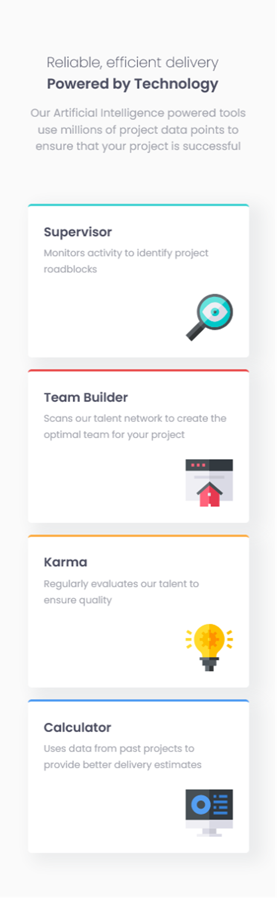

# Frontend Mentor - Four card feature section solution

This is a solution to the [Four card feature section challenge on Frontend Mentor](https://www.frontendmentor.io/challenges/four-card-feature-section-weK1eFYK). Frontend Mentor challenges help you improve your coding skills by building realistic projects. 

## Table of contents

- [Overview](#overview)
  - [The challenge](#the-challenge)
  - [Screenshot](#screenshot)
  - [Links](#links)
- [My process](#my-process)
  - [Built with](#built-with)
  - [Useful resources](#useful-resources)
- [Author](#author)
- [Acknowledgments](#acknowledgments)

## Overview

### The challenge

Users should be able to:

- View the optimal layout for the site depending on their device's screen size

### Screenshot   
  

### Links

- Solution URL: [Frontend Mentor](https://your-solution-url.com)
- Live Site URL: [Github Pages](https://your-live-site-url.com)

## My process

### Built with

- Semantic HTML5 markup
- CSS custom properties
- CSS Grid
- Mobile-first workflow

### Useful resources

- [clamp()](https://developer.mozilla.org/en-US/docs/Web/CSS/clamp) - I  was struggling with font size on the title and subtitle on the mobile design. Responsive typography works well because you don't have to write more CSS code in a media query. I really liked this pattern and will use it going forward.

## Author

- Github - [bccpadge](https://github.com/bccpadge)
- Frontend Mentor - [bccpadge](https://www.frontendmentor.io/profile/bccpadge)

## Acknowledgments

I would like to thank everyone who replied to already submitted  Four card feature section solution. The feedback they gave was helpful and how implment CSS Grid for the desktop design. 
